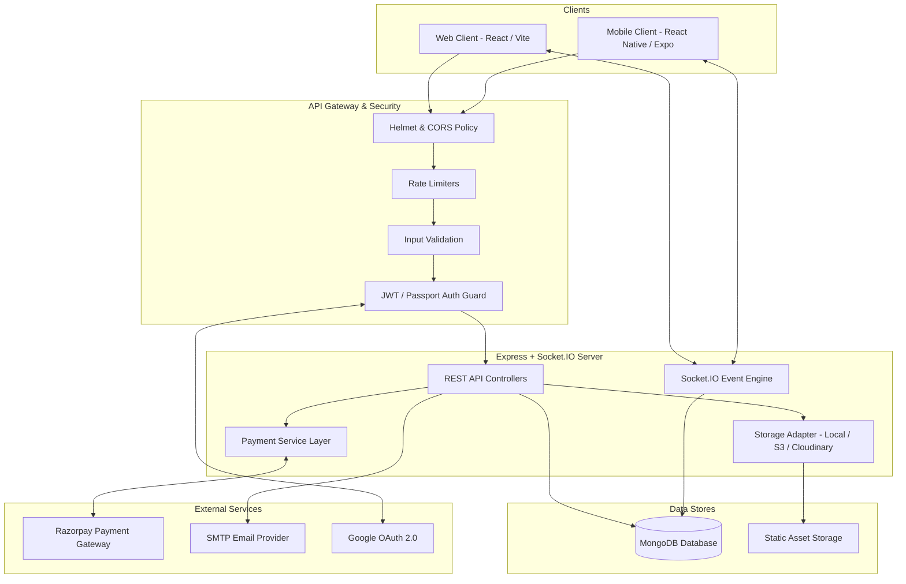
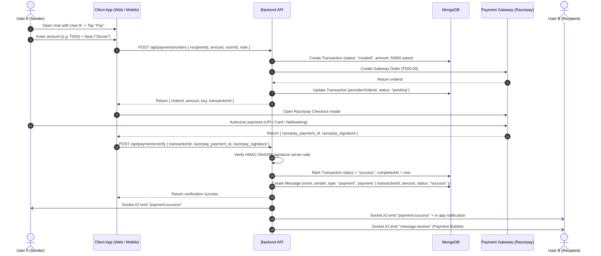

# ChatApp System Architecture

## 1. Overview
ChatApp is a production-grade, real-time cross-platform communication and person-to-person (P2P) payments application. It allows users to chat in real time, make one-to-one and group WebRTC audio/video calls, and exchange secure payments directly inside chat conversations.

The system supports:
- **Web**: Modern Vite + React SPA with responsive Tailwind CSS.
- **Mobile**: Cross-platform React Native / Expo application for Android, iOS, and Web.
- **Backend**: Scalable Node.js / Express REST API + Socket.IO real-time server with MongoDB.

---

## 2. Current Architecture vs. New Architecture

### Existing Architecture
- **Web Frontend**: Vite + React 18 SPA utilizing Axios for REST requests and Socket.IO for real-time messaging, WebRTC direct P2P signaling, and basic local state.
- **Backend**: Express.js server with MongoDB (Mongoose), JWT auth, Nodemailer for OTP email verification, and Passport.js for Google OAuth.
- **Communication Flow**: Sockets handled in `socket/socketHandler.js` for message delivery, typing indicators, user presence, and call signaling. Media uploads were encoded as raw base64 data URLs inside Socket.IO events.
- **Limitations**: No payments support, no message reactions/editing/pinning/deletion, base64 data strings limited to small sizes, no mobile client architecture, lacking centralized error handling and rate limiting.

### New Architecture
- **Backend Core**: Hardened Express.js API with `helmet`, granular rate-limiters, request validation, standardized API response envelopes, centralized error handlers, and `/health` monitoring.
- **Payment Engine**: Modular payment abstraction layer (`PaymentProvider`) supporting Razorpay (sandbox & live) and a deterministic Mock/Test provider for automated testing and offline dev. Handles order creation, HMAC-SHA256 signature verification, idempotent webhook ingestion, and transaction state machines.
- **Payments-Chat Integration**: Extended `Message` model with `type: "payment"`, referencing the immutable `Transaction` record. Sockets emit targeted `payment:*` events only to authorized parties.
- **Storage Layer**: Modular storage adapter (`localStorageAdapter`, `s3StorageAdapter`, `cloudinaryStorageAdapter`) handling multipart file uploads, eliminating base64 payloads over WebSockets.
- **Web Client**: Polished UI with sleek dark/light theme, modern typography, removed legacy Kotha branding, integrated payment bubbles, chat composer payment actions, and wallet transaction history.
- **Cross-Platform Mobile (Expo Router + TypeScript)**: Standalone native mobile architecture in `mobile/` with typed API client, secure storage, optimistic offline caching, native WebRTC calling abstraction, and Expo Push Notification hooks.

---

## 3. High-Level Architecture Diagram

---

## 4. Data Flow

### 4.1 Authentication Flow
1. **User Sign Up**: Client posts credentials (`username`, `email`, `password`) to `POST /api/auth/register`.
2. **OTP Dispatch**: Server hashes a 6-digit cryptographic OTP, saves hash with 10-minute expiry on user model, and emails the code via Nodemailer.
3. **Email Verification**: User posts OTP to `POST /api/auth/verify-email`. Upon match, user is marked `isEmailVerified: true` and receives a signed JWT.
4. **Google OAuth**: Client redirects to `GET /api/auth/google`. Callback validates user, generates JWT, and redirects to client callback with token query param.
5. **Session Persistence**: JWT stored securely (LocalStorage in Web; SecureStore / AsyncStorage in Mobile) and attached as `Authorization: Bearer <token>` header to Axios requests and handshake token in Socket.IO.

### 4.2 Chat Messaging Flow
1. **Sending Messages**:
   - For text messages: emitted via `socket.emit("message:send", { roomId, content, replyTo, mentions })`.
   - For attachments: uploaded via `POST /api/messages/upload` (multipart), returning media URL. Then emitted via socket.
2. **Server Validation**: Server verifies user membership in the room, validates payload, persists the `Message` document to MongoDB, and populates sender and mention details.
3. **Broadcasting**: Message is broadcast to all active sockets in `room_<id>` via `message:receive`.
4. **Offline Resilience**: Mobile client optimistically shows pending message state, queueing requests if offline and retrying upon reconnection.

### 4.3 WebRTC Calling Flow
1. User A initiates call (`call:offer` for direct; `call:room:start` for group).
2. Signaling server verifies room membership and forwards offer to target recipient(s) via `call:incoming`.
3. Recipient sends `call:answer`. ICE candidates are exchanged asynchronously (`call:ice` / `call:room:ice`).
4. P2P peer connection is established with direct audio/video streams.
5. Call teardown (`call:end` / `call:room:leave`) gracefully closes peer tracks and releases socket rooms.

---

## 5. Payment Flow & Chat Integration

---

## 6. Deployment Architecture

- **Backend**: Hosted on cloud platforms (e.g., Render, Railway, AWS ECS) with Node.js runtime, HTTPS termination, and horizontal scale-readiness via Redis adapter for Socket.IO when clustered.
- **Database**: MongoDB Atlas replica set with automated backups and indexes on user, room, message, and transaction fields.
- **Frontend Web**: Static Single Page Application hosted on Render / Cloudflare Pages / Vercel with SPA routing rewrite rules.
- **Mobile**: Built via Expo Application Services (EAS Build) into standalone Android `.apk` / `.aab` and iOS `.ipa` binaries.
